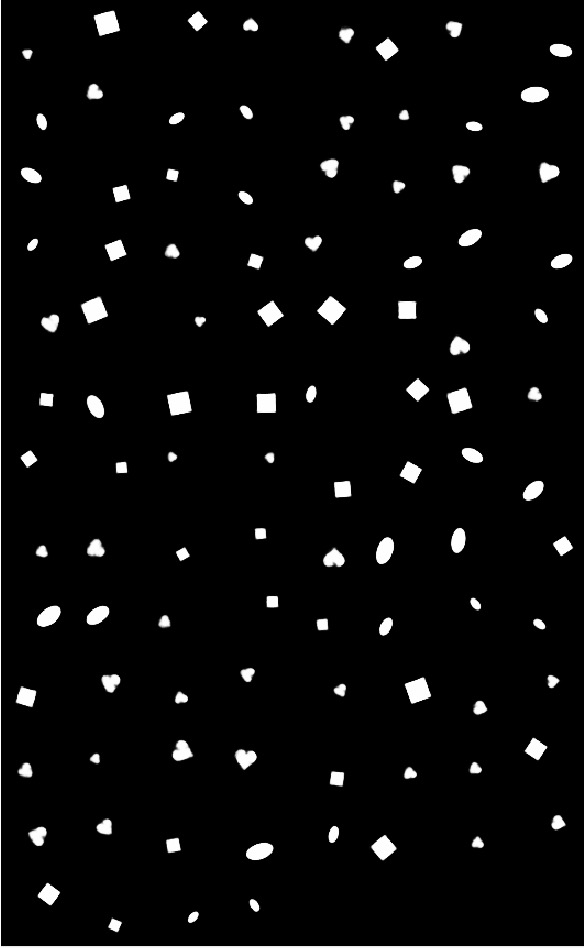

## Train $\beta$-VAE on 2D_shapes dataset

### 1. Configuration

Refer to the [config](../config/twoD.yaml) file, and [model](../models/twoD_model.py). The architecture seems like below:

| Encoder                                    | Decoder                                        |
| ------------------------------------------ | ---------------------------------------------- |
| Input, 64x64x1                             | Input, 32                                      |
| Conv 32x4x4, stride 2, **RELU**, padding 1 | FC, 256, , **RELU**                            |
| Conv 32x4x4, stride 2, **RELU**, padding 1 | FC, 256, , **RELU**                            |
| Conv 32x4x4, stride 2, **RELU**, padding 1 | Upconv, 32x4x4, stride 2, **RELU**, padding 1  |
| Conv 64x4x4, stride 2, **RELU**, padding 1 | Upconv, 32x4x4, stride 2,  **RELU**, padding 1 |
| FC, 256, **RELU**                          | Upconv, 32x4x4, stride 2, **RELU**, padding 1  |
| FC, 256, 2*32 (latent), bernoulli          | Upconv, 32x4x4, stride 2, padding 1            |

### 2. Training Curve
<table align='center'>
<tr align='center'>
<th> VAE Loss</th>
<th> β-VAE (β = 4)</th>
</tr>
<tr align='left'>
<td>
<td>
</tr>
</table>

### 3. Experiment Result

<table align='center'>
<tr align='center'>
<th> VAE fix noise</th>
<th> β-VAE (β = 4) fix noise</th>
</tr>
<tr>
<td>
<td>
</tr>
<tr align='center'>
<th> VAE Random</th>
<th> β-VAE (β = 4) Random</th>
</tr>
<tr align='left'>
<td>
<td>
</tr>
</table>

<table align='center'>
<tr align='center'>
  <th> InfoGAN </th>
</tr>
<tr align='center'>
<td>
</tr>
</table>

#### Disentanglement Metric

I cannot implement the architecture based on the Table1, so I design my own architecture and shows below (==ddd==). Due to time, I just inference the network one time, the InfoGAN architecture is not optimized, so the performance has big distance than Figure 6. I will try to improve it in the future.

| **Discriminator $D$/ recognition network $Q$**  | Generator $Q$                                            |
| ----------------------------------------------- | -------------------------------------------------------- |
| Input 64 x 64 Color image                       | Input $\in \Bbb{R}^{10}$                                 |
| 4x4 conv. 64 **IRELU**, stride 2                | 1x1 upconv. 256. **RELU**, batchnorm, stride 2           |
| 4x4 conv. 128 **IRELU**, stride 2, batchnorm    | 1x1 upconv. 256. **RELU**. batchnorm, stride 2           |
| 4x4 conv. 256 **IRELU**, stride 2, batchnorm    | 4x4 upconv. 128. **RELU**. batchnorm, stride 2           |
| 4x4 conv. 256 **IRELU**, batchnorm              | 4x4 upconv. 64. **RELU**. batchnorm, stride 2, padding 1 |
| 4x4 conv. 256 **IRELU**, batchnorm, padding 1   | 4x4 upconv. 64. **RELU**. batchnorm. stride 2, padding 1 |
| $D$, 2x2 conv. 1, sigmoid, output               | 4x4 upconv. 32. **RELU**. batchnorm. stride 2, padding 1 |
| $Q$, 2x2 conv. 128 **IRELU**, batchnorm, output | 4x4 upconv. 1, , padding 1 **tanh**                      |

| Model   | Disentanglement |
| ------- | --------------- |
| InfoGAN |                 |
| VAE     |                 |
| *β*-VAE |                 |

