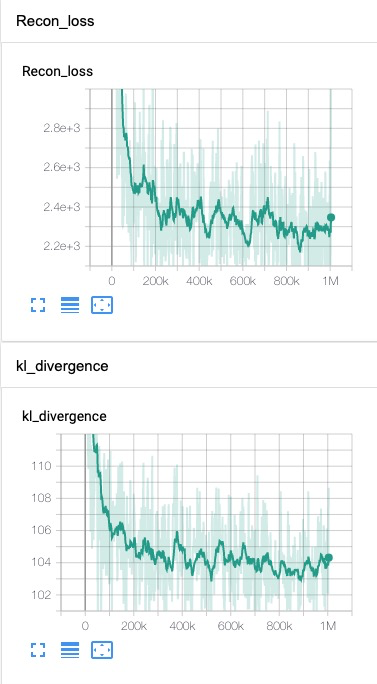
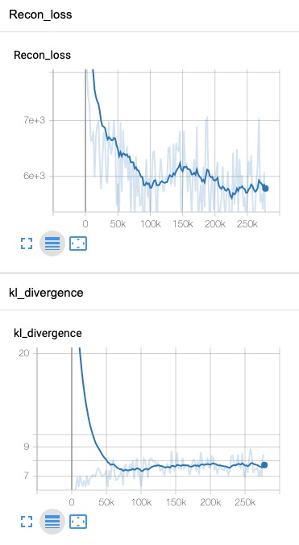
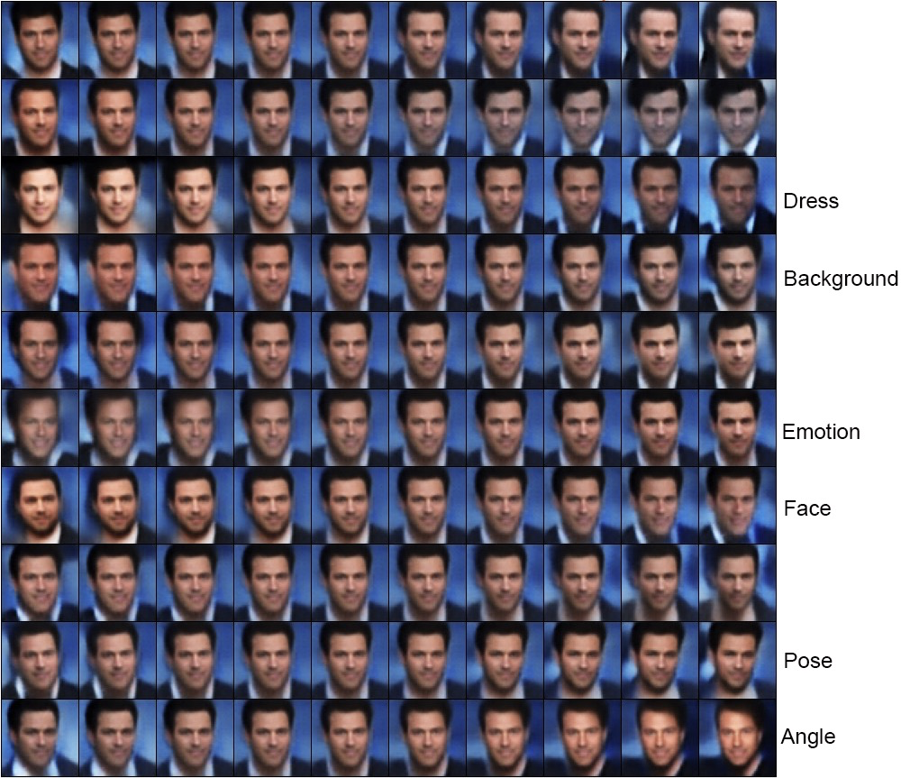
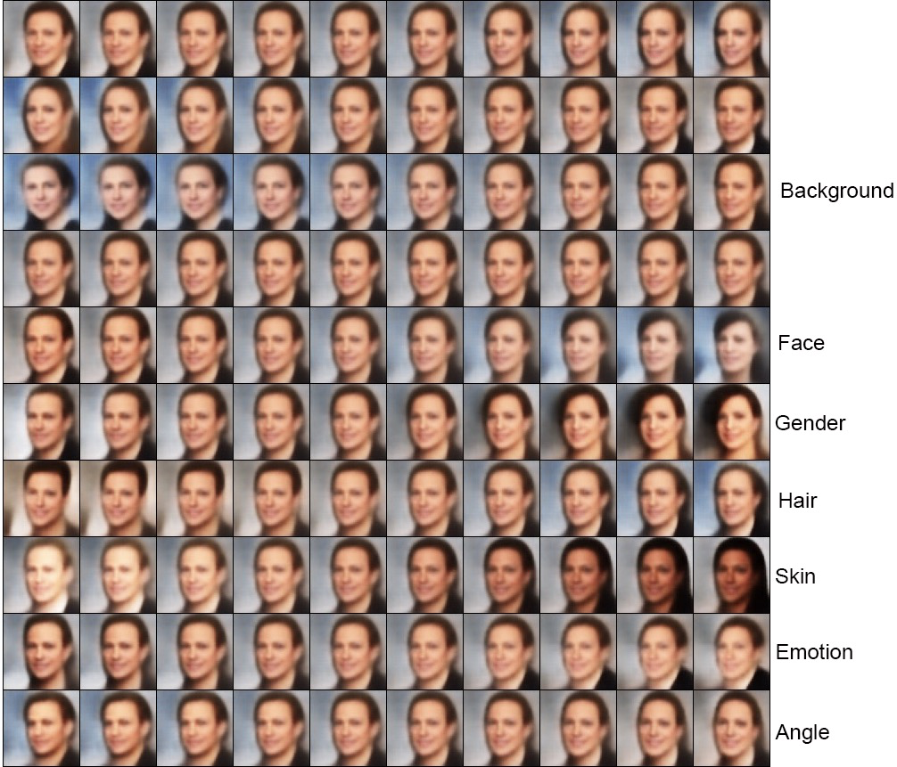
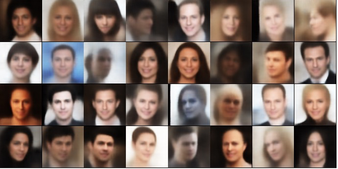
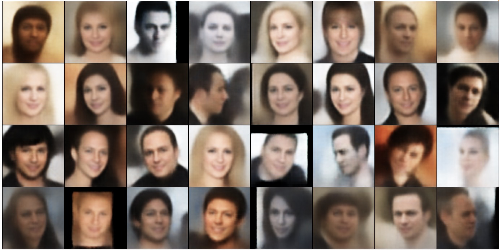
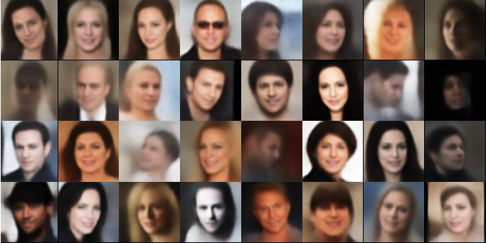
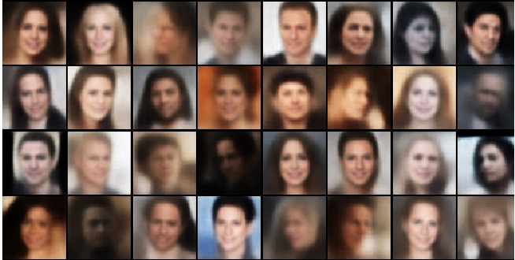
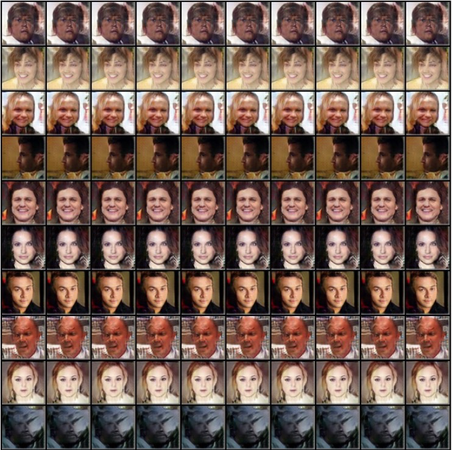
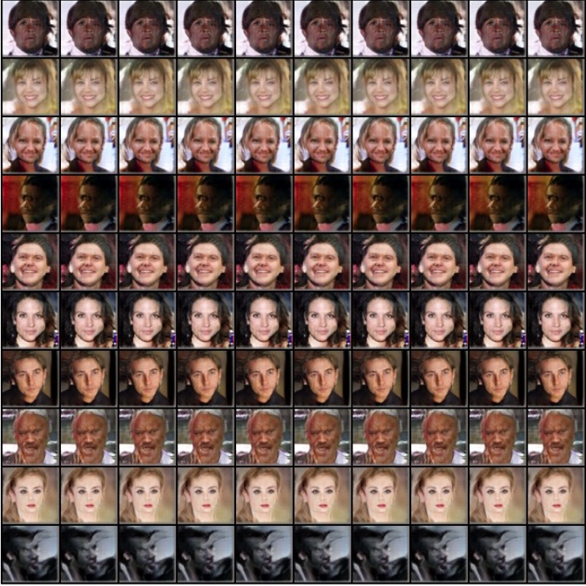

## Train β-VAE on CASIA_webface dataset

### 1. Configuration

Refer to the [config](../config/casia.yaml) file, and [model](../models/casia_model.py). The architecture seems like below:

| Encoder                                     | Decoder                                        |
| ------------------------------------------- | ---------------------------------------------- |
| Input, 64x64x3                              | Input, 32                                      |
| Conv 32x4x4, stride 2, **RELU**, padding 1  | FC, 256, , **RELU**                            |
| Conv 32x4x4, stride 2, **RELU**, padding 1  | Upconv, 256x4x4, , **RELU**                    |
| Conv 64x4x4, stride 2, **RELU**, padding 1  | Upconv, 64x4x4, stride 2, **RELU**, padding 1  |
| Conv 64x4x4, stride 2, **RELU**, padding 1  | Upconv, 64x4x4, stride 2,  **RELU**, padding 1 |
| Conv 256x4x4, stride 1, **RELU**, padding 1 | Upconv, 32x4x4, stride 2, **RELU**, padding 1  |
| FC, 256, 2*32 (latent)                      | Upconv, 32x4x4, stride 2, padding 1            |

*Beside, I test [AlexNet](https://papers.nips.cc/paper/4824-imagenet-classification-with-deep-convolutional-neural-networks.pdf) and [ResNet](https://arxiv.org/abs/1512.03385) backbone as encoder part, you can refer the source code to get more information.*

### 2. Training Curve
#### 2.1 VAE
<table align='center'>
<tr align='center'>
<th> VAE Loss</th>
<th> β-VAE (β = 10)</th>
</tr>
<tr align='left'>
<td></td>
<td></td>
</tr>
</table>

### 3. Experiment Result 

<table align='center'>
<tr align='center'>
<th> VAE fix noise</th>
<th> β-VAE (β = 10) fix noise</th>
</tr>
<tr>
<td></td>
<td></td>
</tr>
<tr align='center'>
<th> VAE Random</th>
<th> β-VAE (β = 10) Random</th>
</tr>
<tr>
<td></td>
<td></td>
</tr>
</table>

<table align='center'>
<tr align='center'>
<th  colspan = '3'> Other architecture</th>
</tr>
<tr align='center'>
<th>ResNet</th>
<th>AlexNet</th>
<th>Transpose</th>
</tr>
<tr align='center'>
<td></td>
<td></td>
<td></td>
</tr>
</table>

<table align='center'>
<tr align='center'>
  <th colspan='2'> InfoGAN </th>
</tr>
<tr align='center'>
  <td></td>
  <td></td>
</tr>
</table>

#### Annotation

<table align='center'>
<tr align='center'>
  <th> VAE </th>
</tr>
<tr align='center'>
  <td></td>
</tr>
<tr align='center'>
  <th>β- VAE(β=10) </th>
</tr>
<tr align='center'>
<td></td>
</tr>
</table>

