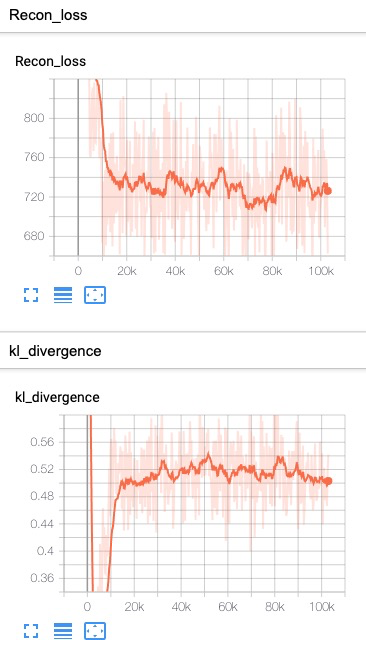
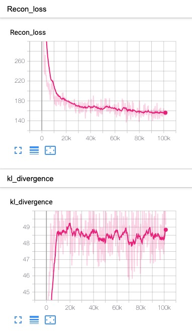
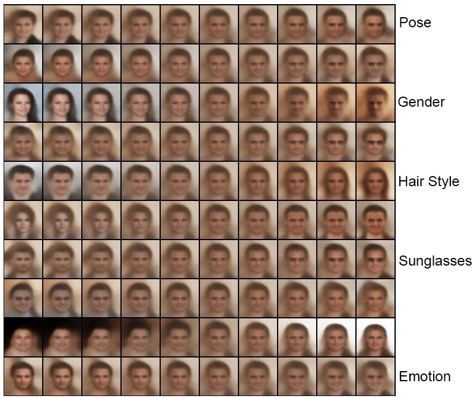

## Train β-VAE on CelebA dataset

### 1. Configuration

Refer to the [config](../config/celeba.yaml) file, and [model](../models/celeba_model.py),  the code follow the basic line of Table.1 in [paper](https://openreview.net/forum?id=Sy2fzU9gl). The architecture seems like below

| Encoder                                     | Decoder                                        |
| ------------------------------------------- | ---------------------------------------------- |
| Input, 64x64x3                              | Input, 32                                      |
| Conv 32x4x4, stride 2, **RELU**, padding 1  | FC, 256, , **RELU**                            |
| Conv 32x4x4, stride 2, **RELU**, padding 1  | Upconv, 256x4x4, , **RELU**                    |
| Conv 64x4x4, stride 2, **RELU**, padding 1  | Upconv, 64x4x4, stride 2, **RELU**, padding 1  |
| Conv 64x4x4, stride 2, **RELU**, padding 1  | Upconv, 64x4x4, stride 2,  **RELU**, padding 1 |
| Conv 256x4x4, stride 1, **RELU**, padding 1 | Upconv, 32x4x4, stride 2, **RELU**, padding 1  |
| FC, 256, 2*32 (latent)                      | Upconv, 32x4x4, stride 2, padding 1            |

### 2. Training Curve
<table align='center'>
<tr align='center'>
<th> VAE Loss</th>
<th> β-VAE (β = 250)</th>
</tr>
<tr align='left'>
<td>
<td>
</tr>
</table>

### 3. Experiment Result 

<table align='center'>
<tr align='center'>
<th> VAE fix noise</th>
<th> β-VAE (β = 250) fix noise</th>
</tr>
<tr>
<td>
<td>
</tr>
<tr align='center'>
<th> VAE Random</th>
<th> β-VAE (β = 250) Random</th>
</tr>
<tr>
<td>
<td>
</tr>
</table>

<table align='center'>
<tr align='center'>
  <th> InfoGAN </th>
</tr>
<tr align='center'>
<td>
</tr>
</table>

#### Training Annotation

<table align='center'>
<tr align='center'>
  <th> VAE </th>
</tr>
<tr align='center'>
  <td></td>
</tr>
<tr align='center'>
  <th>β- VAE(β=250) </th>
</tr>
<tr align='center'>
<td></td>
</tr>
</table>

