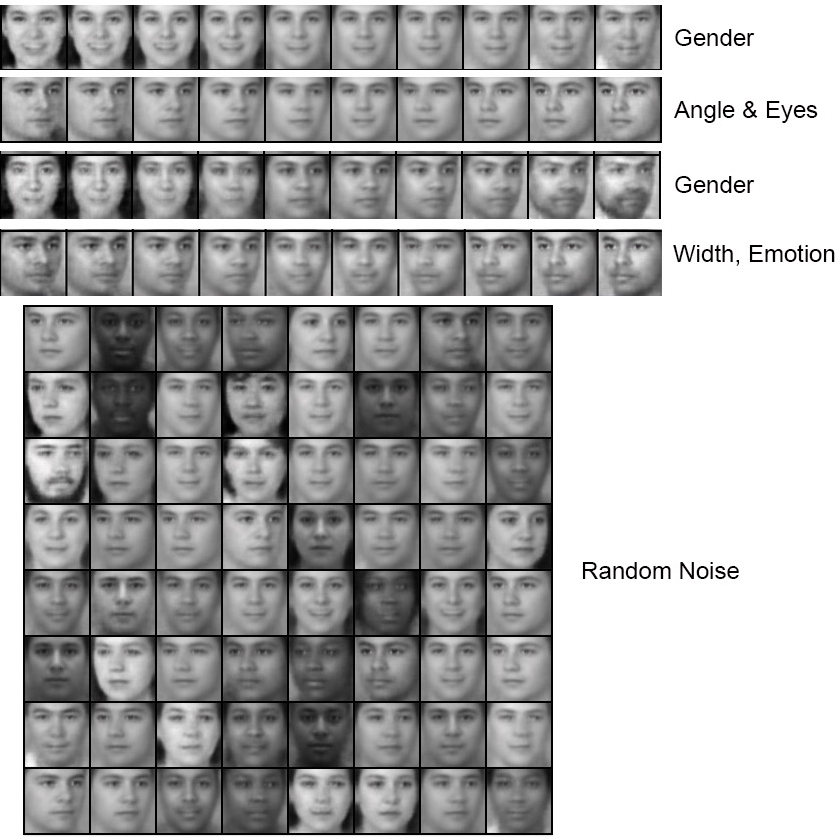

## Train $\beta$-VAE on FACES dataset

### 1. Configuration

Refer to the [config](../config/faces.yaml) file, and [model](../models/faces_model.py),  the code follow the basic line of Table.1 in [paper](https://openreview.net/forum?id=Sy2fzU9gl). The architecture seems like below. I use two dataset, *Feret* and *Faces*.

| Encoder                                     | Decoder                                        |
| ------------------------------------------- | ---------------------------------------------- |
| Input, 64x64x1                              | Input, 32                                      |
| Conv 32x4x4, stride 2, **RELU**, padding 1  | FC, 256, , **RELU**                            |
| Conv 32x4x4, stride 2, **RELU**, padding 1  | Upconv, 256x4x4, , **RELU**                    |
| Conv 64x4x4, stride 2, **RELU**, padding 1  | Upconv, 64x4x4, stride 2, **RELU**, padding 1  |
| Conv 64x4x4, stride 2, **RELU**, padding 1  | Upconv, 64x4x4, stride 2,  **RELU**, padding 1 |
| Conv 256x4x4, stride 1, **RELU**, padding 1 | Upconv, 32x4x4, stride 2, **RELU**, padding 1  |
| FC, 256, 2*32 (latent) bernoulli                      | Upconv, 1x4x4, stride 2, padding 1             |

### 2. Training Curve

#### 2.1 Feret

##### 2.1.1 Feret VAE

##### 2.1.2 Feret *β*-VAE (*β* = 20)

#### 2.2 Faces

##### 2.2.1 Faces VAE

##### 2.2.2 Feret *β*-VAE (*β* = 20)

### 3. Experiment Result 

#### 3.1 Feret

<table align='center'>
<tr align='center'>
<th> VAE </th>
<th> β-VAE (β = 20) </th>
</tr>
<tr>
<td>
<td>
</tr>
</table>

<table align='center'>
<tr align='center'>
  <th> InfoGAN </th>
</tr>
<tr align='center'>
<td>
</tr>
</table>

#### 3.2 FACES

<table align='center'>
<tr align='center'>
<th> VAE </th>
<th> β-VAE (β = 20) </th>
</tr>
<tr>
<td>
<td>
</tr>
</table>

<table align='center'>
<tr align='center'>
  <th> InfoGAN </th>
</tr>
<tr align='center'>
<td >
</tr>
</table>